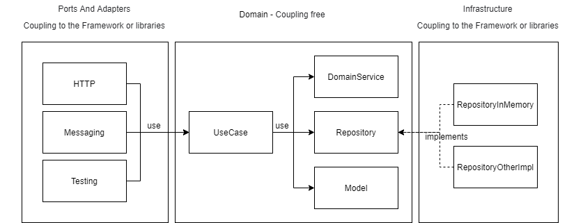

# Operación Fuego de Quasar.

### Instrucciones de ejecución.
El proyecto se realizó con el lenguaje de programación Java y el framework Spring (Spring Boot). Se da por hecho que ya se cuenta con la instalación de JDK 11 y Maven 3.x. 

Para ejecutar la aplicación siga los siguientes pasos:

1. Una vez descargado el código fuente diríjase a la carpeta raíz del proyecto y ejecute el siguiente comando: `mvn clean package`
2. Estando en la raíz del proyecto dirijace a la carpeta **target** 
3. Dentro de la carpeta **target** ejecute el siguiente comando: `java -jar com.starwars.quasar-1.0.0-RELEASE.jar`

Puede encontrar la demostración con Open API en el siguiente enlace: 
[Operación Fuego de Quasar](http://ec2-18-116-50-39.us-east-2.compute.amazonaws.com:8080/swagger-ui.html)

- Autor: Federico Farias Sánchez.
- Correo electrónico: federico.farias@outlook.com
- Linkedin: https://www.linkedin.com/in/federico-farias

### Acerca de la arquitectura.

La aplicación está basada en la arquitectura hexagonal, también conocido como puertos y adaptadores, esto con el fin de desacoplar lo mayormente posible el negocio del framework en turno por lo que se cuenta con los siguientes paquetes principales.

- ***application***
- ***domain***
- ***infrastructure***

##### Diagrama general de arquitectura.

#### Application
Dentro de este paquete se encuentran el subpaquete `http` que denota conceptualmente el puerto/adaptador al que pertenece su contenido.

A continuación, se describe el propósito de cada subpaquete.

- **http:** Representa conceptualmente la interfaz/puerto de entrada (como podría ser soap, messaging, etc).
  - **config:** Configuración propia de la interfaz/puerto de entrada, como lo son los ControllerAdvice y configuración de OpenApi.
  - **mapping:** En este paquete se almacenan los DataMapper que se encargan de transformar los datos de entrada de la interfaz/puerto a los datos de entrada para el negocio.
  - **rest:** Este paquete contiene los adaptadores (RestController) de la interfaz/puerto (http).
  - **schema:** Este paquete contiene los esquemas de los request y response de la interfaz/puerto de entrada.
  - **usecase:** Este paquete tiene como propósito el almacenar los casos de uso que fungen como punto de entrada de nuestro negocio, a partir de este punto la lógica de negocio se desacopla por completo del Framework en turno o de cualquier otra librería externa.

#### Domain
Dentro de este paquete se encuentra todo lo referente al negocio dado que contiene los contratos (interfaces) en caso de requerir tolerancia al cambio, se cuenta con los servicios, modelos, repositorios y excepciones, logrando con esto aislar toda la lógica de negocio evitando contaminarlo con referencias al Frawework o librerías externas.

#### Infrastructure
Este paquete cuenta con las implementaciones concretas de los contratos del dominio, el propósito principal del paquete es almacenar aquellas clases que requieren de las dependencias correspondientes al Framework y/o librerías externas, dependencias tales como spring data o alguna librería de mensajería entre otras.